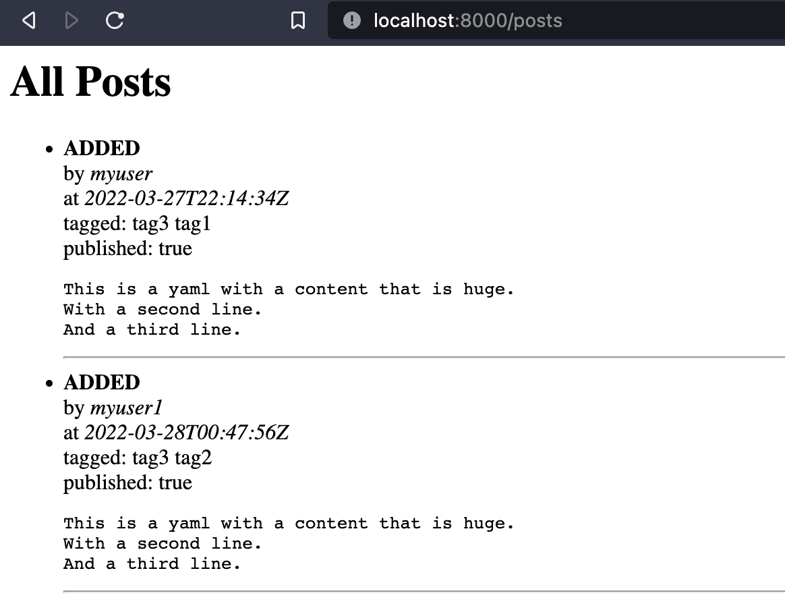

=====
Forum
=====

This is an example of a Forum application, built using Kubernetes as a database
backend, Falcon as the web framework and utilizes Server Side Events as the
mechanism to relay all changes to custom resource to browser.

Running
=======

In order to run the example, first, create a venv and install the CRD in the
cluster::

  $ python3 -m venv venv
  $ source venv/bin/activate
  $ pip install -r requirements.txt
  $ python app.py
  Installing CRD <class '__main__.Post'> to cluster.

Then, you can start the actual web server to serve the changes as event stream::

  $ uvicorn app:app
  INFO:     Started server process [42700]
  INFO:     Waiting for application startup.
  INFO:     Application startup complete.
  INFO:     Uvicorn running on http://127.0.0.1:8000 (Press CTRL+C to quit)

Then, open a web browser at http://127.0.0.1:8000/posts

In order to see the changes in the browser, open a 2nd terminal (so as to not
disturb) the web server, and create a new Custom Resource::

  $ kubectl apply -f resources/crd-1.yaml
  $ kubectl apply -f resources/crd-2.yaml

Both of these should look like the following in the browser:

